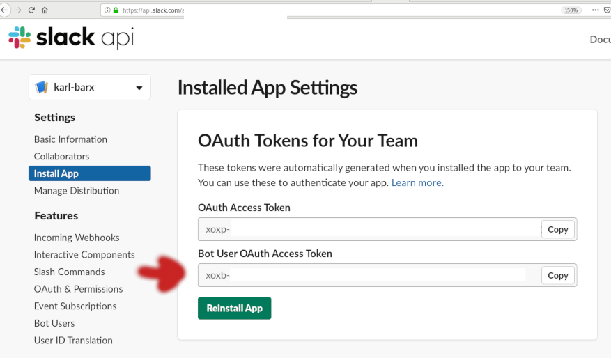

# GarfieldBot

A multi-purpose Slack bot for the MUN Computer Science Society Slack.

## Clone the repository

`git clone https://github.com/MUNComputerScienceSociety/GarfieldBot.git`

## Add your bot token

Since there are integration limits within each Slack workspace, it is recommended that you create your own for local development. Within this workspace, find and copy your "Bot User OAuth Access Token". 

1. Type `cp .env.dist .env` to create a new private file within the repository that you will use to store your OAuth token.
2. Use your favorite text editor (vim) to edit `.env`. You will need to paste your OAuth Access Token in here.

## Setting up for local development

1. Ensure Python 3.6 or newer is installed
2. Add your OAuth Access Token as described above
3. Install dependencies
   * macOS and Linux: `python3 -m pip install -r requirements.txt`
   * Windows: `python -m pip install -r requirements.txt`
4. Run Start.py

## Deploying locally (with Docker on Linux hosts)

*Note:* Depending on your setup, you may need to run these commands as root. These steps may be similar on macOS, but are untested. _Let us know if you have tried it!_

1. Build the container with `docker build -t garfieldbot .`  _Don't forget the trailing period!_
2. Run the container with `docker run garfieldbot`

## Submitting your changes

Have you created a plugin that you think we'll like? Fixed a bug? Added more documentation? Send us a pull request with your changes, and we'll check it out!

